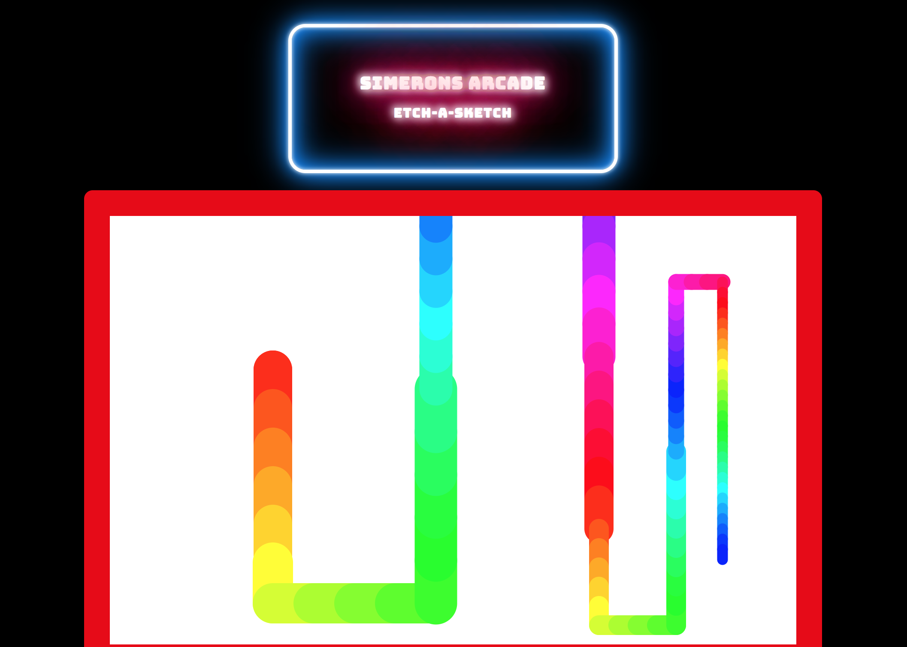
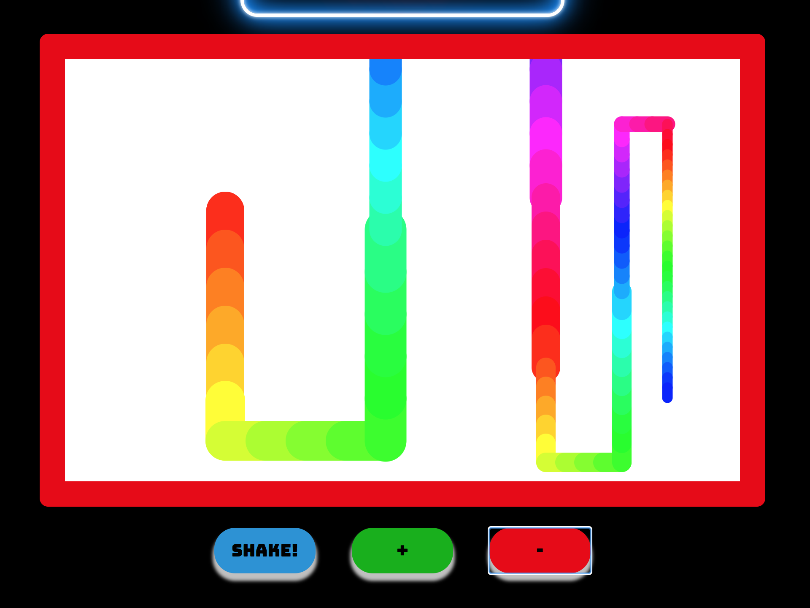

## Welcome to Simeron's Arcade! 🕹👾🎲🎮🃏

### Etch-a-sketch 🎨✍🏽

### Simerons arcade is a series of litte mini applications. Design to help me learn and put all my learnings in one place. The arcade will bit filled with a varity of different types of apps (sorry they aren't all games! 😅) there will some games, calculators, and other everyday essential items that have been transformed with HTML / CSS / JS. I want to use this as a chance to me to upskill in a bitsized fashion and to use my love of design along the way. The design may now always be conventional... But hopefully it will always be with beautiful or fun!

### Enjoy!

#### How to use the Etch-a-sketch

1. Refresh the page if you want to move your starting position or use the shake button.
2. Use your arrow keys to move around the canvas and create your amazing drawings
3. Use the `+` button to increase the size of the brush stroke
4. Use the `-` button to decrease the size of the brush stroke
5. Use the `shake` button to clear your etch-a-sketch screen

**Where I was inspired:** I have been working through a Wes Bos course which I brought during lockdown to upskill and refresh my JavaScript skills. On this particular take I have rebuilt the etch-a-sketch as much as I can and made references when I needed it. Plus I added my own feature:

**Increasing and Decreasing** the brush size that can be used on the canvas Refreshed the design to fit into the arcade.

**Accessibility:** You can uses your mouse keys to use the shake, increase and decrease buttons. Use the enter key while your focused on one of the buttons use their action. CSS for these states and pending in the works!

